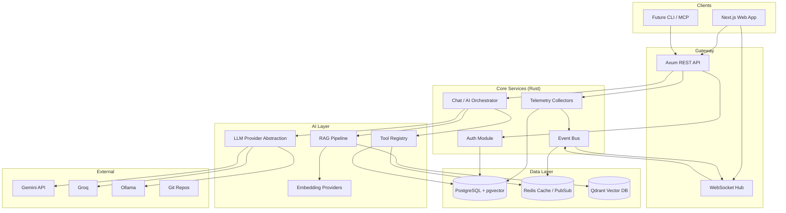
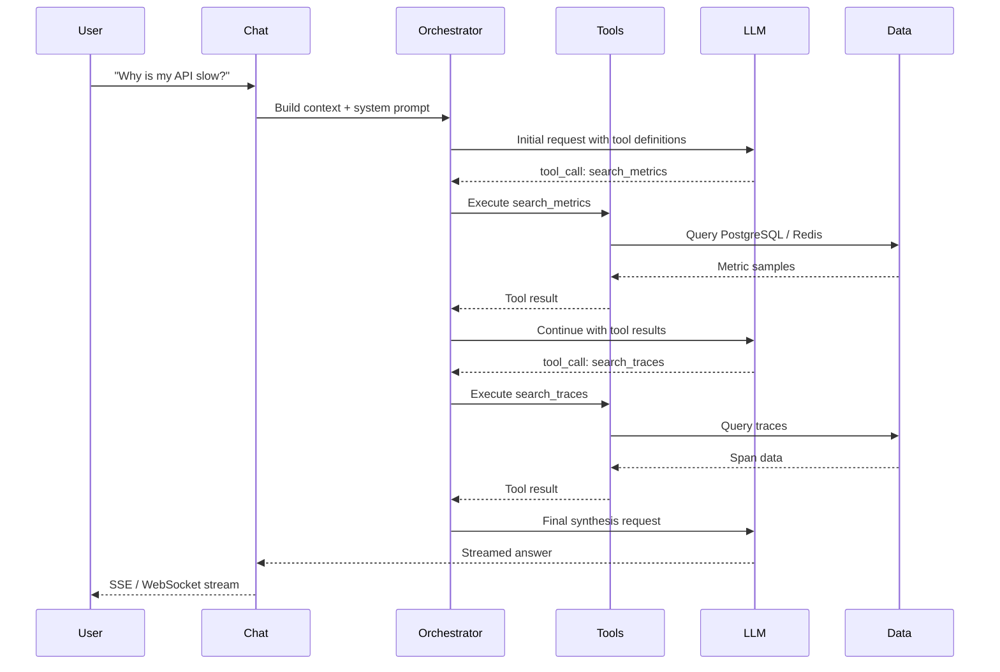
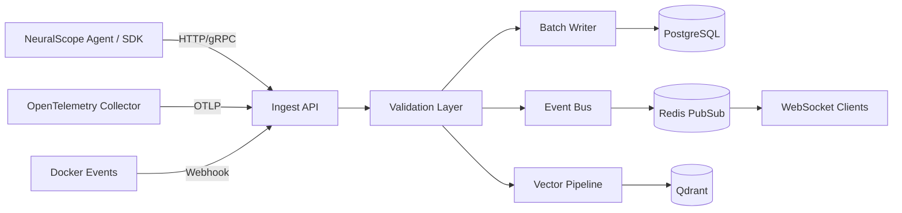
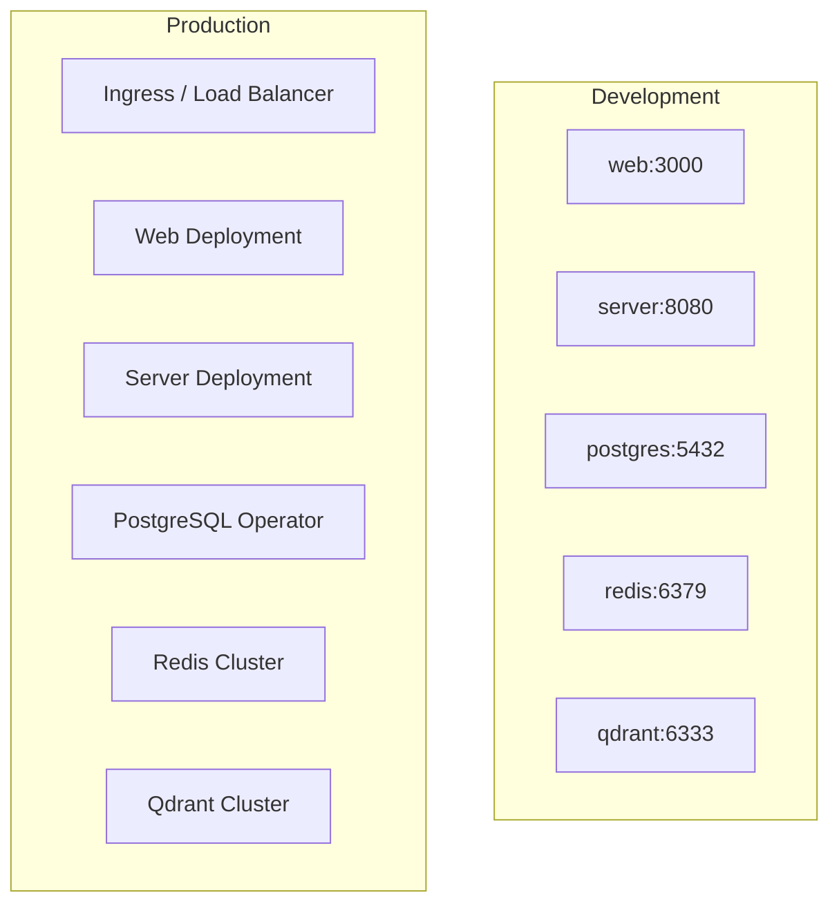

# NeuralScope Architecture

> An AI-powered developer observability platform built with Rust.

## Vision

NeuralScope unifies logs, metrics, traces, network traffic, Git history, and security signals into a single platform where developers ask natural-language questions and receive context-aware answers. The AI orchestration layer retrieves evidence from multiple data sources before synthesizing responses.

## High-Level System Diagram



## Monorepo Layout

```
NeuralScope/
├── apps/
│   ├── web/          # Next.js 15+ frontend (React 19)
│   └── server/       # Rust Axum backend
├── packages/
│   ├── ui/           # Shared shadcn/ui component library
│   ├── shared/       # Cross-platform types, schemas, constants
│   └── config/       # Shared ESLint, TypeScript, Tailwind configs
├── infra/
│   ├── docker/       # Dockerfiles
│   └── k8s/          # Kubernetes manifests
├── docs/             # Extended documentation
├── docker-compose.yml
└── .github/workflows/
```

## Clean Architecture (Backend)

Each feature module follows a layered structure inspired by DDD and Clean Architecture:

```
feature/
├── domain/       # Entities, value objects, domain errors, traits (ports)
├── application/  # Use cases, service orchestration, DTOs
├── infrastructure/ # Repository impls, external API clients
└── presentation/ # HTTP handlers, WebSocket handlers, request/response types
```

**Dependency rule:** `presentation → application → domain ← infrastructure`

Infrastructure implements domain traits. Application depends on abstractions, never concrete DB or HTTP clients.

### Backend Modules

| Module | Responsibility |
|--------|----------------|
| `api` | Router composition, middleware stack, OpenAPI, health checks |
| `ai` | LLM provider abstraction, tool registry, prompt templates, streaming |
| `auth` | Better Auth integration, sessions, API keys, RBAC |
| `logs` | Log ingestion, indexing, search, structured parsing |
| `metrics` | CPU, memory, disk, HTTP latency, custom metrics |
| `network` | Connection tracking, traffic analysis, graph data |
| `traces` | OpenTelemetry trace ingestion, span queries, flame graphs |
| `git` | Commit history, diffs, deployment correlation |
| `architecture` | Service dependency graph generation and storage |
| `security` | Secret scanning, config audit, vulnerability reports |
| `chat` | Conversation management, context assembly, streaming responses |
| `vector` | Embeddings, Qdrant indexing, semantic search |
| `events` | Real-time event bus, WebSocket fan-out |
| `db` | Connection pools, migrations, shared repository utilities |
| `common` | Config, errors, telemetry, utilities |

## AI Orchestration Flow



### AI Tools

| Tool | Data Source | Purpose |
|------|-------------|---------|
| `search_logs` | PostgreSQL | Full-text + semantic log search |
| `search_metrics` | PostgreSQL / Redis | Time-series metric queries |
| `search_traces` | PostgreSQL | Distributed trace lookup |
| `search_git` | PostgreSQL + Git | Commit/deployment correlation |
| `search_architecture` | PostgreSQL | Service dependency graph |
| `search_codebase` | Qdrant + Git | Semantic code search (RAG) |
| `search_docs` | Qdrant | Documentation retrieval |
| `search_security` | PostgreSQL | Security events and findings |
| `search_network` | PostgreSQL | Network connection analysis |

### LLM Provider Abstraction

```rust
#[async_trait]
pub trait LlmProvider: Send + Sync {
    async fn complete(&self, request: CompletionRequest) -> Result<CompletionResponse, LlmError>;
    async fn complete_stream(&self, request: CompletionRequest) -> Result<CompletionStream, LlmError>;
    fn supports_tools(&self) -> bool;
}
```

Implementations: `GeminiProvider`, `GroqProvider`, `OpenRouterProvider`, `OllamaProvider`.

## Data Flow: Telemetry Ingestion



## Database Schema (Overview)

| Table | Purpose |
|-------|---------|
| `users` | User accounts, preferences |
| `projects` | Multi-tenant project/workspace isolation |
| `logs` | Structured log entries (partitioned by time) |
| `metrics` | Time-series metric data points |
| `traces` | Trace and span records |
| `incidents` | Detected or reported incidents |
| `chat_history` | AI conversation threads and messages |
| `vectors` | Embedding metadata (vectors stored in Qdrant) |
| `network_events` | Network connection records |
| `deployments` | Deployment events linked to Git commits |

PostgreSQL extensions: `pgvector` for in-DB similarity when Qdrant is unavailable.

## Frontend Architecture

```
apps/web/
├── app/                    # Next.js App Router
│   ├── (dashboard)/        # Authenticated layout group
│   │   ├── overview/
│   │   ├── logs/
│   │   ├── metrics/
│   │   ├── traces/
│   │   ├── chat/
│   │   ├── git/
│   │   ├── architecture/
│   │   ├── network/
│   │   ├── security/
│   │   ├── incidents/
│   │   └── settings/
│   ├── (auth)/             # Login / register
│   └── api/                # BFF routes (optional proxy)
├── components/             # Shared UI primitives
├── features/               # Feature-sliced modules
│   ├── logs/
│   ├── metrics/
│   ├── chat/
│   └── ...
├── hooks/                  # Shared React hooks
├── lib/                    # Utilities, API client
├── services/               # TanStack Query service layer
└── types/                  # Frontend-specific types
```

**State management:**
- Server state: TanStack Query
- Client UI state: Zustand
- Real-time: WebSocket hooks with automatic reconnection

**Design system:** Dark-first, glassmorphism cards, Framer Motion transitions, Recharts for metrics, React Flow for network/architecture graphs, Monaco for log/trace viewers.

## Real-Time Architecture

```
Collector → Event Bus (Tokio broadcast) → Redis PubSub → WebSocket Hub → Clients
```

Event types: `log.new`, `metric.sample`, `trace.complete`, `network.connection`, `incident.created`, `deployment.detected`.

## Security Model

- **Authentication:** Better Auth (session + API keys)
- **Authorization:** Project-scoped RBAC (owner, admin, viewer)
- **Data isolation:** Row-level security per project
- **Secrets:** Never logged; scanned content redacted before storage
- **API:** Rate limiting via Tower middleware, CORS restricted to configured origins

## Deployment Topology



## Performance Principles

1. **Async everywhere** — Tokio runtime, non-blocking I/O
2. **Connection pooling** — SQLx pool, Redis multiplexed connections
3. **Batch inserts** — Telemetry buffered and written in batches
4. **Caching** — Redis for hot queries, metric aggregations
5. **Streaming** — AI responses and log tailing via SSE/WebSocket
6. **Partitioning** — Time-based partitions for logs, metrics, traces

## Testing Strategy

| Layer | Approach |
|-------|----------|
| Domain | Pure unit tests, no I/O |
| Application | Mock repositories via trait objects |
| Infrastructure | Integration tests with testcontainers |
| API | HTTP tests with `axum-test` |
| Frontend | Vitest + React Testing Library |
| E2E | Playwright (future milestone) |

## Incremental Build Plan

| Milestone | Scope |
|-----------|-------|
| **M1** ✅ | Architecture, monorepo scaffold, docs |
| **M2** ✅ | Rust server foundation: config, DB, API router, health |
| **M3** ✅ | Auth module + PostgreSQL migrations |
| **M4** ✅ | Log ingestion + real-time WebSocket streaming |
| **M5** ✅ | Metrics + traces collectors |
| **M6** ✅ | AI orchestration layer + Gemini provider |
| **M7** ✅ | Chat UI + tool execution loop |
| **M8** ✅ | Network graph + architecture view |
| **M9** ✅ | Security scanner + incident reports |
| **M10** ✅ | Dashboard polish, CI/CD, K8s manifests |
| **M11** ✅ | Production hardening: CORS, rate limits, RBAC, auth middleware |
| **M12** ✅ | RAG pipeline + Qdrant vector indexing and semantic search |
| **M13** ✅ | Git commit history, deployment ingest, and correlation UI |
| **M14** | MCP server exposure |
| **M15** | E2E tests in CI |

## Future: MCP Integration

NeuralScope will expose an MCP server allowing AI assistants (Cursor, Claude Desktop) to query observability data directly. The tool registry in the `ai` module is designed to be reusable as MCP tool definitions.
